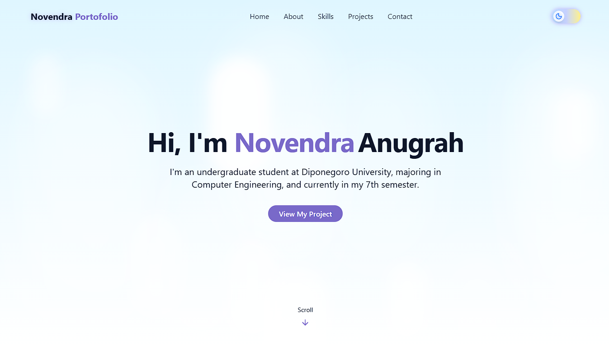
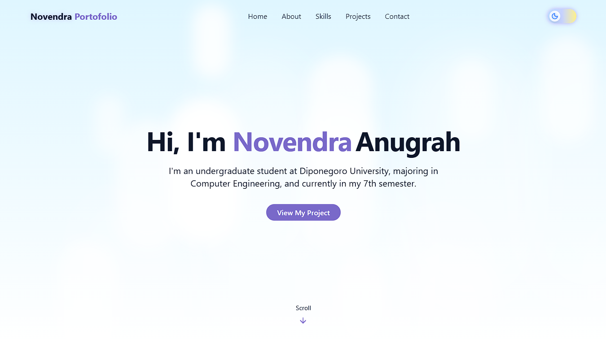
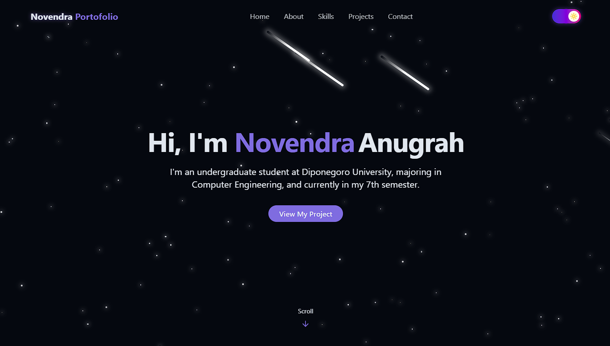
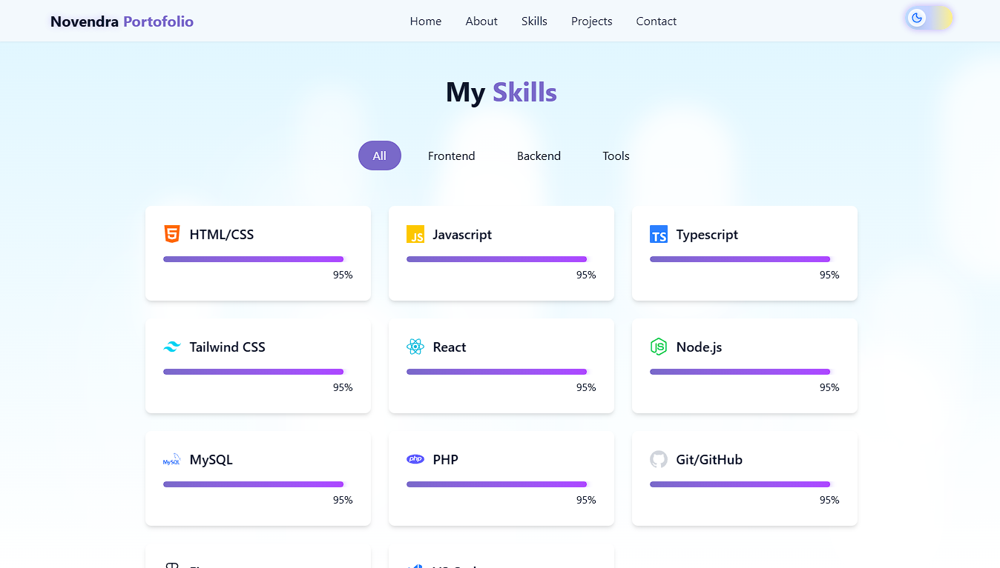
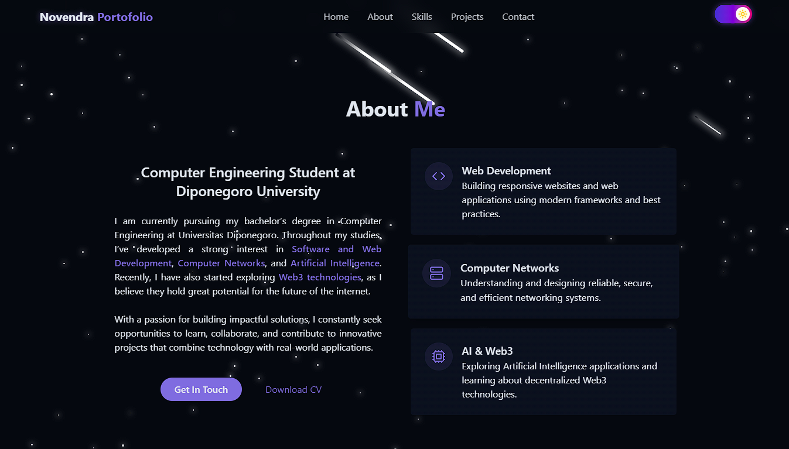
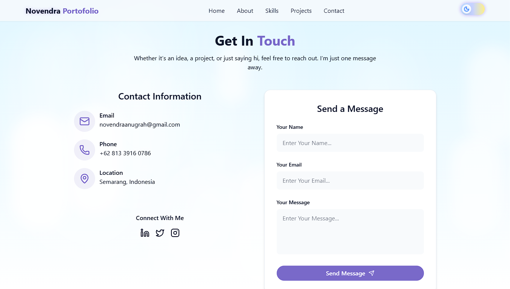

# 🌐 My First Modern Portfolio Website

<div align="center">
    <br>
      
    </br>
    <div>
      
      
      
  </div>
</div>

---

## 📑 Table of Contents

1. [Introduction](#-introduction)  
2. [Tech Stack](#-tech-stack)  
3. [Features](#-features)  
4. [Quick Start](#-quick-start)  
5. [Screenshots](#-screenshots)  
6. [Deployment](#-deployment)  
7. [Useful Links](#-useful-links)  

---

## 🚀 Introduction

This is my very first **modern portfolio website**, built with  
**React**, **Vite**, and **Tailwind CSS**.  
The project is inspired by a YouTube tutorial with additional modifications and improvements.  

🔗 Visit here: [Novendra Portfolio](https://novendraa.my.id)  

Credit to: [PedroTech](https://www.youtube.com/@PedroTechnologies)  
🎥 Watch the full tutorial: [YouTube](https://www.youtube.com/watch?v=ifOJ0R5UQOc)  

---

## ⚙️ Tech Stack

- **React** – Component-based UI development  
- **Vite** – Lightning-fast build tool  
- **TailwindCSS** – Utility-first CSS for styling  
- **Lucide Icons** – Clean and modern icon pack  
- **React Icons** – Alternative icons  
- **Radix UI** – Accessible component primitives  
- **Framer Motion** – Smooth animations  
- **JavaScript** – Core programming language  
- **GitHub & Vercel** – Source control and deployment  

---

## ⚡️ Features

- 🌑 **Light/Dark Mode Toggle**  
  Saves theme preference in local storage with beautiful transitions  

- 💫 **Animated Backgrounds**  
  Includes stars, meteors, clouds, scroll effects, and glowing UI elements  

- 📱 **Responsive Navigation**  
  Desktop and mobile menus styled with glassmorphism  

- 👨‍💻 **Hero & About Sections**  
  Showcase who you are with smooth intro animations and interactive buttons  

- 📊 **Skills Grid**  
  Filterable categories with animated progress bars  

- 🖼️ **Projects Showcase**  
  Display project screenshots, tech stacks, and GitHub/demo links  

- 📩 **Contact Section**  
  Social icons + responsive contact form with toast notifications  

- 🚀 **One-Click Deployment**  
  Easily host your site with Vercel and GitHub  

---

## 👌 Quick Start

### Prerequisites

* [Node.js](https://nodejs.org/)
* [Git](https://git-scm.com/)

### Clone and Run

```bash
git clone https://github.com/yourusername/react-tailwind-portfolio.git
cd react-tailwind-portfolio
npm install
npm run dev
```

Your app will be available at: [http://localhost:5173](http://localhost:5173)

---

## 🖼️ Screenshots

<div>
 
 
 
 
 
</div>

---

## ☁️ Deployment

### Deploy on Vercel

1. Push your code to GitHub
2. Go to [vercel.com](https://vercel.com)
3. Import your repository
4. Click **Deploy**

Your live website will be hosted on a Vercel subdomain (e.g. `https://your-name.vercel.app`)
or if you have your own domain, you can connect it as well.

---

## 🔗 Useful Links

* [React Documentation](https://reactjs.org/)
* [Tailwind CSS Docs](https://tailwindcss.com/)
* [Lucide Icons](https://lucide.dev/)
* [React Icons](https://react-icons.github.io/react-icons/)
* [Radix UI](https://www.radix-ui.com/)
* [Framer Motion](https://motion.dev/)
* [Vite](https://vitejs.dev/)
* [Vercel](https://vercel.com/)